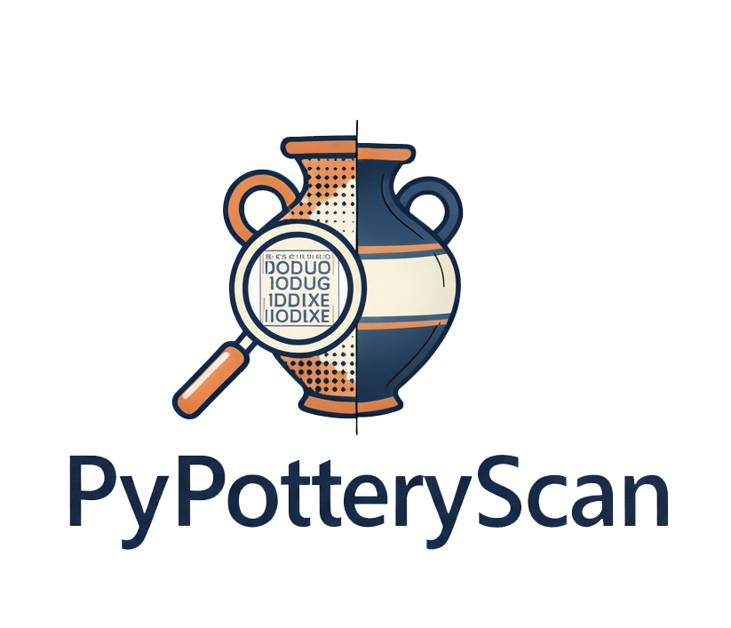

# PyPotteryScan 🏺

<div align="center">
  
  
  **AI-Powered Archaeological Drawing Processor**
  
  [](LICENSE)
  [](https://www.python.org/downloads/)
  [](https://developer.nvidia.com/cuda-downloads)
</div>

---

## 📋 Overview

**PyPotteryScan** is a specialized tool for archaeologists and researchers to automate the extraction and annotation of ceramic artifact drawings. Built on state-of-the-art OCR technology ([OlmOCR-7B](https://huggingface.co/allenai/olmOCR-7B)), it streamlines the tedious process of digitizing archaeological documentation.

Part of the **PyPottery Suite**:
- 🔍 **PyPotteryLens** - Automatic vessel detection in scanned plates
- 🖊️ **PyPotteryInk** - Digital inking and enhancement
- 📐 **PyPotteryTrace** - Vector conversion (Illustrator-style)
- 📄 **PyPotteryLayout** - Automated plate composition
- 📝 **PyPotteryScan** - OCR extraction and annotation (this tool)

---

## ✨ Features

### 🎯 Core Capabilities
- **Batch Processing** - Load entire folders of archaeological plates
- **Interactive Annotation** - Draw bounding boxes around vessels and text areas
- **Advanced OCR** - Powered by OlmOCR-7B (4-bit quantized for efficiency)
- **Manual Mode** - Skip OCR for manual text entry when needed
- **Drawing Cleanup** - Built-in eraser tool to remove unwanted artifacts
- **Review & Correction** - Side-by-side preview and text editing interface
- **Structured Export** - Save as organized folders with CSV metadata

### 🚀 Technical Highlights
- Full-resolution image processing (no quality loss)
- Responsive canvas interface with auto-scaling
- Real-time model loading status with progress tracking
- UTF-8 BOM support for international characters (accents, diacritics)
- Automatic browser launch when server is ready
- Undo/redo support for drawing cleanup

---

## 🛠️ Installation

### Prerequisites
- Python 3.8 or higher
- 4GB+ VRAM (GPU) or 8GB+ RAM (CPU mode)
- Modern web browser (Chrome/Edge recommended for File System Access API)

### Setup

1. **Clone the repository**
   ```bash
   git clone https://github.com/yourusername/PyPotteryScan.git
   cd PyPotteryScan
   ```

2. **Install dependencies**
   ```bash
   pip install -r requirements.txt
   ```

3. **Download the model** (see `DOWNLOAD_MODEL.md`)
   ```bash
   # The model will be automatically downloaded on first run
   # Or manually download from: https://huggingface.co/allenai/olmOCR-7B
   ```

4. **Start the server**
   ```bash
   python ocr_server.py
   ```
   
   The browser will automatically open when the model is loaded!

---

## 📖 Usage

### Workflow Overview

```
1. LOAD        → Select folder with scanned plates
2. ANNOTATE    → Draw boxes around vessels and text
3. PROCESS OCR → Automatic text recognition
4. CLEAN       → Remove unwanted areas with eraser
5. REVIEW      → Verify and correct OCR results
6. EXPORT      → Save images + CSV metadata
```

### Step-by-Step Guide

#### 1️⃣ **Load Images**
- Click "Select Folder" and choose your scanned plates directory
- Supported formats: JPG, PNG
- Preview thumbnails appear for navigation

#### 2️⃣ **Annotate Drawings**
- **Blue boxes** = Vessel/drawing boundaries
- **Red boxes** = Text areas linked to drawings
- Add metadata: Table/Plate name, Context, Notes
- Navigate between images with Prev/Next

#### 3️⃣ **Process OCR**
- Click "Start OCR Processing" for automatic text extraction
- OR click "Skip OCR" to enter text manually later
- Real-time progress bar and detailed console log

#### 4️⃣ **Clean Drawings**
- Use the **Eraser Tool** to remove unwanted elements
- Adjust eraser size with slider (5-100px)
- **Undo** button for mistakes
- Works on full-resolution images with thumbnail preview

#### 5️⃣ **Review Texts**
- Side-by-side layout: drawing preview + text editor
- Correct OCR errors or add manual annotations
- Changes auto-save on export

#### 6️⃣ **Export**
- Choose export prefix (e.g., "SantaGiulia_2015")
- Creates folder structure:
  ```
  /images/
    prefix_001.jpg
    prefix_002.jpg
    ...
  prefix_data_YYYY-MM-DD.csv
  ```

### CSV Output Format

```csv
filename,original_image,drawing_number,table_name,context,notes,ocr_result,ocr_corrected
SantaGiulia_001.jpg,plate_01.jpg,1,Tavola I,Bronze Age,Fragment,...,CORRECTED TEXT
```

---

## ⚙️ Configuration

### Model Settings
The tool uses **OlmOCR-7B** in 4-bit quantization mode for memory efficiency:
- **CUDA Mode**: ~3.5-4GB VRAM
- **CPU Mode**: ~8GB RAM (slower)

Edit `ocr_server.py` to adjust:
```python
MODEL_NAME = "allenai/olmOCR-7B"
QUANTIZATION = "4bit"  # or "8bit" or None
```

### Server Configuration
```python
HOST = "localhost"
PORT = 5001
CORS_ORIGINS = "*"  # Adjust for production
```

---

## 🎨 Screenshots

### Annotation Interface

*Interactive canvas with bounding box drawing*

### OCR Processing

*Real-time progress tracking with detailed logs*

### Review & Correction

*Side-by-side preview and text editing*

---

## 🔬 Technical Details

### Architecture
```
Frontend (ceramic-workflow-v2.html)
   ↓
   ├─ Canvas API (full-res processing)
   ├─ File System Access API (exports)
   └─ Fetch API (OCR requests)
         ↓
Backend (ocr_server.py)
   ↓
   ├─ Flask Server (CORS enabled)
   ├─ OlmOCR-7B Model
   └─ PyTorch + Transformers
```

### Model Details
- **Base Model**: Qwen2.5-VL-7B-Instruct
- **Optimization**: 4-bit quantization (bitsandbytes)
- **Task**: Optical Character Recognition
- **License**: Apache 2.0
- **Paper**: [OlmOCR](https://arxiv.org/abs/2501.05756)

---

## 📊 Performance

| Mode | Hardware | Speed | Memory |
|------|----------|-------|--------|
| CUDA | RTX 3060 (12GB) | ~2-3s per text box | 4GB VRAM |
| CUDA | RTX 4090 (24GB) | ~1-2s per text box | 4GB VRAM |
| CPU  | AMD Ryzen 7 | ~15-20s per text box | 8GB RAM |

*Note: First run includes model download (~7-8GB)*

---

## 🐛 Troubleshooting

### Common Issues

**Browser doesn't open automatically**
- Check if port 5001 is already in use
- Manually open: `http://localhost:5001`

**Model loading fails**
- Ensure sufficient disk space (~10GB)
- Check CUDA installation: `nvidia-smi`
- Try CPU mode by setting `device="cpu"` in `ocr_server.py`

**UTF-8 encoding issues in CSV**
- CSV includes UTF-8 BOM for Excel compatibility
- Open with Excel, LibreOffice, or any UTF-8 compatible editor

**Eraser creates black areas instead of white**
- This was fixed in v2.0 - update to latest version

---

## 🤝 Contributing

Contributions welcome! Please:
1. Fork the repository
2. Create a feature branch (`git checkout -b feature/amazing-feature`)
3. Commit changes (`git commit -m 'Add amazing feature'`)
4. Push to branch (`git push origin feature/amazing-feature`)
5. Open a Pull Request

---

## 📜 Citation

If you use PyPotteryScan in your research, please cite:

```bibtex
@software{pypotteryscan2025,
  title = {PyPotteryScan: AI-Powered Archaeological Drawing Processor},
  author = {Cardarelli, Lorenzo},
  year = {2025},
  url = {https://github.com/yourusername/PyPotteryScan}
}
```

And the underlying OCR model:

```bibtex
@article{olmocr2025,
  title={OlmOCR: Advancing OCR with Large Multimodal Models},
  author={[Authors from Allen Institute]},
  journal={arXiv preprint arXiv:2501.05756},
  year={2025}
}
```

---

## 📄 License

This project is licensed under the MIT License - see [LICENSE](LICENSE) file for details.

The OlmOCR-7B model is licensed under Apache 2.0 by the Allen Institute for AI.

---

## 👤 Author

**Lorenzo Cardarelli**
- Archaeological Tool Development
- Digital Humanities & Computational Archaeology

---

## 🙏 Acknowledgments

- [Allen Institute for AI](https://allenai.org/) - OlmOCR-7B model
- [Hugging Face](https://huggingface.co/) - Model hosting and transformers library
- Archaeological community for feedback and testing

---

## 🔗 Related Projects

- [PyPotteryLens](https://github.com/yourusername/PyPotteryLens) - Vessel detection
- [PyPotteryInk](https://github.com/yourusername/PyPotteryInk) - Digital inking
- [PyPotteryTrace](https://github.com/yourusername/PyPotteryTrace) - Vector conversion
- [PyPotteryLayout](https://github.com/yourusername/PyPotteryLayout) - Plate composition

---

<div align="center">
  Made with ❤️ for the archaeological community
  
  **[Documentation](docs/) • [Issues](issues/) • [Discussions](discussions/)**
</div>
