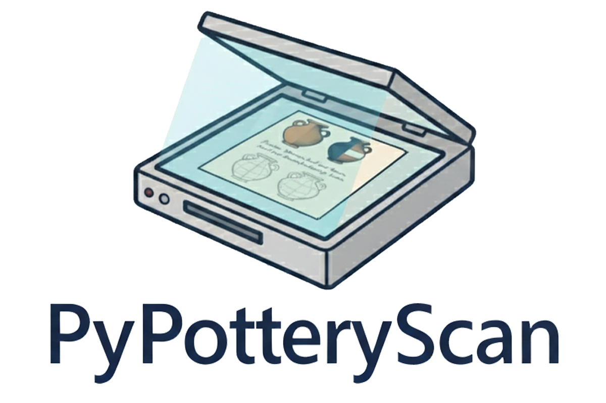

# PyPotteryScan

<div align="center">



[](https://github.com/lrncrd/PyPotteryScan)
[](https://www.python.org/downloads/)
[](https://github.com/lrncrd/PyPotteryScan)
[](https://github.com/lrncrd/PyPotteryScan)

</div>

**Part of the [PyPottery Suite](https://github.com/lrncrd/PyPottery)** - A comprehensive collection of AI-powered archaeological documentation tools.

`PyPotteryScan` is a Flask-based web application for processing and digitizing archaeological pottery drawings with OCR (Optical Character Recognition). It provides a comprehensive workflow for extracting individual drawings from scanned plates, automatically recognizing text annotations, and preparing clean images for digital cataloging.

📚 **[Full Documentation](docs/)** | 🔗 **[Suite Overview](https://github.com/lrncrd/PyPottery)** | 💬 **[Discussions](https://github.com/lrncrd/PyPotteryScan/discussions)**

## Features

- **🗂️ Project Management**: Organize your work with project-based workflow - each archaeological dataset gets its own workspace with dedicated folders and metadata tracking
- **📸 Image Loading**: Import scanned pottery plates from folders with automatic thumbnail generation for fast navigation
- **✏️ Interactive Annotation**: Canvas-based drawing tools for marking pottery profiles and text boxes on plates
- **🔍 OCR Processing**: Automatic text recognition using state-of-the-art vision-language models (OlmOCR)
- **🖼️ Automatic Cropping**: Extract individual drawings with their bounding boxes automatically
- **🎨 Drawing Cleanup**: Interactive eraser tool for removing text annotations from pottery drawings
- **📝 Text Review**: Review and correct OCR results with zoom functionality for detailed verification
- **💾 Full Persistence**: All work is automatically saved - annotations, crops, cleaned drawings, and OCR results
- **📦 Export Tools**: Generate standardized CSV outputs with all metadata and OCR text
- **🌐 Modern Web Interface**: Clean, responsive web UI accessible from any browser

## Installation

### Requirements

- Python 3.12 (tested)
- Modern web browser (Chrome, Firefox, Edge, Safari)
- 16GB RAM minimum (32GB recommended for OCR)
- Optional: NVIDIA GPU with CUDA support or MPS for faster OCR processing

### Quick Installation (Windows)

1. **Download Python 3.12** from [Microsoft Store](https://www.microsoft.com/store/productId/9NRWMJP3717K?ocid=pdpshare) or from [python.org](https://www.python.org/downloads/)

2. **Download PyPotteryScan**: Clone or download this repository

3. **Install dependencies**:
   
   ```bash
   # Create virtual environment
   python -m venv venv
   
   # Activate environment
   venv\Scripts\activate
   
   # Install PyTorch with CUDA (for GPU) or CPU-only
   # For CUDA (NVIDIA GPU):
   pip install torch torchvision torchaudio --index-url https://download.pytorch.org/whl/cu126
   
   # For CPU-only:
   pip install torch torchvision torchaudio
   
   # Install other dependencies
   pip install -r requirements.txt
   ```

4. **Launch the application**:
   
   ```bash
   python app.py
   ```

5. **Access the application**: The web interface will open at `http://localhost:5002`

### UNIX Installation (Linux, macOS)

1. **Ensure Python 3.12 is installed**:

   ```bash
   python3 --version
   ```

2. **Download PyPotteryScan**: Clone or download this repository

3. **Install dependencies**:

   ```bash
   # Create virtual environment
   python3 -m venv venv
   
   # Activate environment
   source venv/bin/activate
   
   # Install PyTorch (with MPS support for Apple Silicon)
   pip install torch torchvision torchaudio
   
   # Install other dependencies
   pip install -r requirements.txt
   ```

4. **Launch the application**:

   ```bash
   python app.py
   ```

5. **Access the application**: Open your browser at `http://localhost:5002`

### Model Downloads

The application automatically downloads OCR models from HuggingFace on first launch:

- **OlmOCR-7B-FP4**: Vision-language model for text recognition (~4.5GB, NVIDIA GPU only)
- **OlmOCR-7B-0825-FP8**: Vision-language model for text recognition (~8.5GB)
- **Qwen3-1.7B**: Language model for text processing (~4GB)

Models are cached in the `models/` directory.

## Getting Started

### Launching the Application

**Manual Launch**: Activate your virtual environment and run:

```bash
# Windows
venv\Scripts\activate
python app.py

# UNIX
source venv/bin/activate
python app.py
```

The application will:

- Start a local web server on port 5002
- Initialize OCR models (first launch may take 2-5 minutes)
- Automatically open your default browser at `http://localhost:5002`
- Display initialization progress

### First Steps

1. **Create a Project**: Click "New Project" and give it a name (e.g., "MonteBibele_2024")
2. **Select Folder**: Choose a folder containing your scanned pottery plates (JPG, PNG)
3. **Annotate**: Draw rectangles around pottery profiles and text boxes
4. **Process OCR**: Let the AI recognize all text annotations automatically
5. **Generate Crops**: Extract individual drawings with metadata
6. **Clean Drawings**: Use the eraser tool to remove text from pottery images
7. **Review Texts**: Verify and correct OCR results with zoom capability
8. **Export**: Generate CSV file with all metadata and OCR text

## Project Structure

The application organizes your work into projects, each with this structure:

```
projects/
└── YourProject_20250107_123456/
    ├── project.json              # Project metadata and workflow status
    ├── original_images/          # Uploaded scanned plates
    ├── thumbnails/               # Cached thumbnails for fast loading
    ├── annotations/              # Drawing and text box coordinates (JSON)
    ├── cropped_drawings/         # Extracted individual pottery drawings
    ├── cleaned_drawings/         # Drawings with text removed
    ├── ocr_results/              # OCR text recognition results
    └── exports/                  # Final CSV exports
```

## Usage Workflow

### 1. 🗂️ Project Management

Create and organize your pottery plate scanning projects. Each project maintains:

- Workflow status tracking (images loaded, annotated, OCR processed, etc.)
- Project metadata with creation date and description
- Isolated folders for all processing stages
- Resume capability - reopen projects and continue where you left off

**Best Practices**:

- Use descriptive project names (e.g., "Veio_Tavole_2024", "MonteCimino_Disegni")
- Projects are automatically timestamped to avoid conflicts
- You can work on multiple projects simultaneously

### 2. 📸 Load Images

Upload scanned pottery plates from a folder on your computer.

**Supported Formats**: JPG, PNG, BMP, TIFF

**Features**:

- Automatic thumbnail generation for fast navigation
- Persistent thumbnail caching (subsequent loads are 10-100x faster)
- Visual indicators showing which images have annotations
- Click any thumbnail to start annotating

**File Organization**:

- Images are copied to `{project}/original_images/`
- Thumbnails cached in `{project}/thumbnails/` (200px max dimension)

### 3. ✏️ Annotate Drawings & Text

Mark pottery profiles and text boxes using interactive canvas tools.

**Annotation Tools**:

- **Drawing Tool (D)**: Draw rectangles around pottery profiles
- **Text Tool (T)**: Draw rectangles around text annotations

**Canvas Features**:

- Pan and zoom for precise marking
- Responsive scaling for different screen sizes
- Real-time coordinate tracking

**Metadata Fields**:

- **Table/Plate Name**: Table identifier (e.g., "Table I", "Plate 12")
- **Context**: Archaeological context (e.g., "Bronze Age", "US 145")
- **Notes**: Additional observations

**Keyboard Shortcuts**:

- `D` - Switch to Drawing tool
- `T` - Switch to Text tool
- `E` - Switch to Eraser
- `←/→` - Navigate between images
- `Ctrl+S` - Save current annotations

**Workflow**:

1. Navigate through images using thumbnails or arrow keys
2. Select Drawing tool and mark pottery profiles
3. Select Text tool and mark all text annotations
4. Metadata auto-saves when you navigate away
5. Visual counters show progress (X drawings, Y text boxes)

**Output**: Annotations saved to `{project}/annotations/{image_name}_annotations.json`

### 4. 🔍 Process OCR

Automatically recognize text from all marked text boxes using AI.

**OCR Engine**: OlmOCR-7B vision-language model with Qwen3 text decoder

**Features**:

- Processes all annotated images automatically
- Detailed logging showing progress and detected text
- Skip option for manual text entry
- Accurate counts of images with text vs. total processed

**Processing Details**:

- Loads full-resolution images dynamically (not limited to canvas-loaded ones)
- Extracts text box regions at full resolution
- Applies OCR model to each text box
- Saves results with image-drawing-textbox hierarchy

**Skip OCR**: You can skip OCR and input text manually in the Review tab if:

- OCR model is not available
- Manual entry is preferred for your use case
- Text is too damaged or unclear for automatic recognition

**Output**: OCR results saved to `{project}/ocr_results/ocr_results_{timestamp}.json`

### 5. 🖼️ Generate Cropped Images

Extract individual pottery drawings based on your annotations.

**Process**:

- Loads all annotated images at full resolution
- Crops each drawing rectangle with padding
- Saves with systematic naming: `{image}_d1.png`, `{image}_d2.png`, etc.
- Generates metadata CSV with coordinates

**Features**:

- Loading overlay with progress tracking
- Processes ALL annotated images (not just canvas-viewed ones)
- Skips images without drawings
- White background fill for consistency

**Output**: 

- Cropped images: `{project}/cropped_drawings/`
- No CSV export at this stage (handled in final export)

### 6. 🎨 Clean Drawings

Remove text annotations from pottery drawings using an interactive eraser.

**Interface Features**:

- Large canvas showing current drawing
- Thumbnail grid for navigation
- Visual indicators (blue border = active, green border = completed)
- Progress counter showing cleaned/total

**Eraser Tool**:

- Adjustable brush size (5-100px)
- Click and drag to erase areas
- Undo function (up to 20 steps)
- Mark as Clean button (M) to mark completion

**Keyboard Shortcuts**:

- `E` - Toggle eraser mode
- `M` - Mark current drawing as clean
- `←/→` - Navigate between drawings

**Workflow**:

1. Drawing loads automatically (original or previously cleaned version)
2. Activate Eraser tool (E key)
3. Paint over text to remove it
4. Use Undo if needed
5. Mark as Clean (M key) when satisfied
6. Navigate to next drawing (arrow keys or thumbnail click)
7. Auto-save preserves your work

**Persistence**:

- All edits auto-save when you navigate away
- Cleaned versions persist across sessions
- Reopening a project loads all cleaned drawings automatically
- Cumulative editing: continue refining previously cleaned drawings

**Output**: Cleaned drawings saved to `{project}/cleaned_drawings/{image}_d{N}_cleaned.png`

### 7. 📝 Review & Correct OCR

Review and correct recognized text with zoom functionality.

**Interface**:

- Two-column layout: Image preview | Editable text
- Image information: Table name, Drawing ID, Text box ID
- Click image to zoom for detailed verification
- All changes auto-save

**Features**:

- Zoom modal with high-resolution image
- Side-by-side comparison of all text boxes
- Editable textarea for each text box
- Changes persist automatically when proceeding to export

**Zoom**:

- Click any text box preview to open zoom modal
- Full-screen overlay with original resolution
- Click X or outside image to close

**Workflow**:

1. Browse through all text boxes
2. Click image to zoom if needed
3. Edit text directly in textarea
4. Corrections auto-save
5. Proceed to Export when review is complete

### 8. 📦 Export Results

Generate final CSV export with all metadata and OCR text.

**Export Contents**:

- Image metadata (table name, context, notes)
- Drawing information (index, bounding box coordinates)
- Text box coordinates
- OCR recognized text (original and corrected)
- Cleaned drawing status

**Export Options**:

- Custom prefix for filename
- Saves to folder selected by user
- Includes subfolder with all cropped drawings
- CSV with complete metadata

**Workflow**:

1. Review summary statistics (tables, drawings, OCR count)
2. Set export prefix (optional)
3. Click "Save to Folder"
4. Choose destination folder
5. Export generates:
   - `images/` folder with renamed drawings
   - CSV file with all data

**Output**: User-selected folder with standardized structure

## Technology Stack

**Backend**:

- **Flask**: Web framework with threaded request handling
- **PyTorch**: Deep learning framework for OCR models
- **Transformers (HuggingFace)**: OlmOCR and Qwen3 model integration
- **Pillow (PIL)**: Image processing and thumbnail generation

**Frontend**:

- **HTML5 Canvas**: Interactive drawing and annotation
- **Tailwind CSS**: Modern responsive UI
- **JavaScript (ES6+)**: Dynamic interface and state management
- **FileReader API**: Client-side image handling

**Data Management**:

- **JSON**: Project metadata and annotations
- **CSV**: Export format for archaeological data
- **File System**: Project-based workspace organization


## Keyboard Shortcuts Reference

### Annotation Tab

- `D` - Drawing tool
- `T` - Text tool
- `E` - Eraser
- `←` - Previous image
- `→` - Next image

### Clean Tab

- `E` - Toggle eraser mode
- `M` - Mark as clean
- `←` - Previous drawing
- `→` - Next drawing

## Documentation

📖 **Complete documentation available in the [docs/](docs/) folder**:

- **[Getting Started](docs/getting-started.md)** - Installation and setup
- **[User Guide](docs/user-guide.md)** - Complete feature walkthrough
- **[Project Management](docs/project-management.md)** - Working with projects
- **[Annotation Workflow](docs/annotation-workflow.md)** - Detailed annotation guide
- **[Troubleshooting](docs/troubleshooting.md)** - Common issues and solutions

🌐 **Suite Documentation**: [PyPottery Wiki](https://github.com/lrncrd/PyPottery)


## Contributing

We welcome contributions to PyPotteryScan! Here are some ways you can help:

- 🐛 **Report bugs**: Open an issue with detailed reproduction steps
- 💡 **Suggest features**: Share ideas for new functionality
- 📖 **Improve documentation**: Help make the docs clearer
- 🧪 **Test on different platforms**: Help verify compatibility
- 💻 **Submit pull requests**: Code contributions are welcome

**[Contribution Guidelines](CONTRIBUTING.md)**

## License

This project is licensed under the terms specified in the [LICENSE](LICENSE) file.


## Acknowledgments

- **OlmOCR**: Vision-language model from Allenai
- **Qwen**: Language model from Alibaba Cloud
- **HuggingFace**: Model hosting and transformers library
- **Flask Community**: Web framework and extensions

## 👥 Contributors

<a href="https://github.com/lrncrd/PyPotteryScan/graphs/contributors">
  
</a>

---

